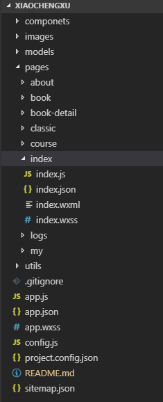

##  微信小程序学习
> 一直都有想做小程序的意愿,一年又一年的,匆匆而过,如果一不小心没抓住时间的尾巴,就会被甩的远远的.在这里分享下在网络找的资源学习的小程序.确实存在很多不足,恳请指导!
### 代码组成

> 小程序中规定了一套自己的标准,  不过是大同小异,配置文件Json,模板文件wxml(类似html),样式代码wxss(类似css),以及逻辑代码javascript组成, 如上图,在page文件夹下的每个文件对应一个页面,页面的配置通过全局的aap.json设置
- app.js是**小程序的app实例**,掌握着小程序的整个生命周期,里面可以写全局相关代码
- app.json**全局的配置文件**,配置页面集合,tabbar,标题背景等全局设置
- app.wxss是小程序的**全局样式表**，决定了全局页面的默认样式，在pages下的页面中的wxss样式会取代默认样式
- project.config.json
### 一, JSON配置
